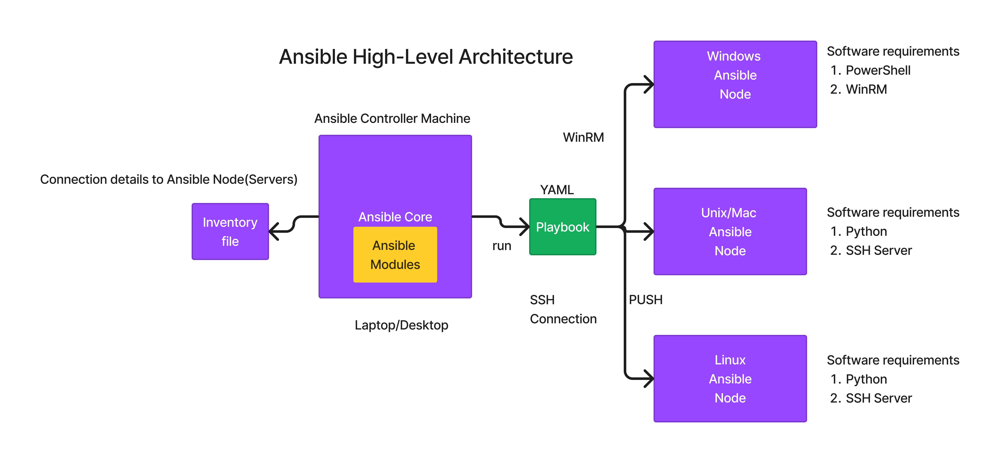

# Day 1

## Info - Hypervisor Overview
<pre>
- virtualization technology
- using Hypervisor, we can run multiple OS in a laptop/desktop/workstation/servers
- i.e many OS can run side by side on the same machine
- There are two types of Hypervisor
  - Type 1 and 
     - used in Servers & Workstations
     - Bare Metal Hypervisors
     - VMs can be created directly on top of Hardware 
     - examples
       - VMWare vSphere/vCenter
       - KVM
  - Type 2
    - used in laptops/desktops and Workstations
    - they can be installed on top a Host OS ( Windows, Linux, Mac )
    - examples
      - VMWare Workstation ( Linux & Windows )
      - VMWare Fusion ( Mac OS-X )
      - Oracle VirtualBox ( Windows, Linux & Mac )
      - Parallels ( Mac OS-X )
      - Microsoft Hyper-v ( Windows )
- the Operating System that runs within the Virtual Machine(VM) are called Guest OS
- each VM represents one fully functional Operating system
  - each OS has its own OS Kernel
  - its own hardware resources
  - its own network and graphics cards
  - has its own file system
  - has its own port range ( 0 to 65535 ports )
- this type of virtualization is called Heavy weight virtualization
  - the reason being, each VM(Guest OS) requires dedicated hardware resources
    - CPU Cores
    - RAM
    - Storage ( HDD/SDD )
    - Virtual Network Cards
    - Virtual Graphics Cards
</pre>

## Info - Containerization Technologydocker run -d --name ubuntu1 --hostname ubuntu1 -p 2001:22 -p 8001:80 tektutor/ubuntu-ansible-node:latest
<pre>
- is a light weight virtualization technology
- all the containers that runs in the same OS/machine, shares the hardware resources available on the Host OS
- all the containers that runs in the same OS/machine, shares the OS Kernel on the Host OS
- each containers represents one application or an application component ( Frontend, Backend(DB Servers), etc.)
- containers are not Operating System
- containers are not a replacement for Virtual Machine or Operating Sytem
- technically containers can be created within a VM or OS installed on a Physical machine
- VMs and containers are used in combination, they are not competing technology they are complementing technology
- as each container is an application process, not a OS, technically comparing a container with a VMs is wrong
- containers and VMs share certain common behaviours/features
  - just like VMs, containers also get their own dedicated Network cards( virtual network card - software defined network cards )
  - just like VMs, containers also get its own dedicated network stack ( 7 OSI Layers )
  - just like VMs, containers also has their own file system
  - just like VMs, containers also get its own port range ( 0 to 65535 ports )
  - just like VMs, containers also get its own IP Address ( generally private IP addresses )
- each container will host one application and its dependent configuration and dependencies
- with containerization technology, one can run linux containerized applications on Linux OS, Windows OS or Mac OS
</pre>

## Info - Container Engine
<pre>
- is a high-level software that helps managing conainers and container images
- is very user-friendly, abstracts all the lowel-level OS features that enables the container technology
- end-users need not have to be an expert in Linux kernel or OS kernel features to create container or manage container images
- under the hood, container engines depends on Container Runtimes
- examples
  - Docker Container Engine depends on containerd which in turn depends on runC container runtime
  - Podman Container Engine depends on CRI-O container runtime
</pre>  

## Info - Container Runtime
<pre>
- is a low-level software that helps managing containers and container images
- it is not so user-friendly, hence end-users don't this use directly
- examples
  - runC container runtime
  - CRI-O container runtime
</pre>

## Info - Container Image
<pre>
- is a blueprint or specification of a container
- any software tool that need on a container has to installed on the image level
- when containers are created using a container image, whatever softwares are installed on the image are made available in the containers
- with One container image, multiple containers instances can be created
- Container Images are similar to Windows/Linux DVD ISO files
</pre>


## Info - Containers
<pre>
- container is a running instance of a Container Image
- each containers get its own IP address
- each container has its own file system, network card, port range, network stack, etc.,
- each container represents one application
- each containers should run only one main application
- though it is technically possible to run mutiple applications within a single container, it is not a best practice
- as per best practice, each container should host only one main application
- For example
  - a container can run a single REST API
  - a container can run a single SOAP API
  - a container can run a single Microservice
  - a container can run a single web server, application service, DB Server, Message Queue Server, etc.,
</pre>

## Info - Docker - Container Application Engine 
<pre>
- is developed in Go lang by a company called Docker Inc
- it follows client/server architecture
- it comes in 2 flavours
  1. Docker Community Edition - Docker CE
     - open source
     - hence no support can be expected
  2. Docker Enterprise Edition - Docker EE
     - requires buying commercial license
     - hence worldwide support is offered by Docker Inc organization
</pre>

## Info - Configuration Management Tools
<pre>
- is a DevOps tool that helps automating system administrative configuration management activities\
- Configuration Management
  - installing a software in Windows/Linux/Unix/Mac, network switches/routers
  - uninstalling a software in Windows/Linux/Unix/Mac, network switches/routers
  - managing Windows/Linux/Unix users
  - installing Oracle/MySql/MongoDB/CouchBase DB Servers, and then creating different DB users with various permissions
  - Importing Databases,tables and populating data into those tables, providing access to required users or denying access to certain users
  - already there is machine with Operating System pre-installed ( this is the assumption )
  - configuring Firewalls, application servers, web servers, connecting a machine to a domain, patching OS, etc.,
- Examples
  - Puppet
  - Chef
  - Salt/SaltStack
  - Ansible
</pre>

## Info - Puppet 
<pre>
- is a configuration management tool
- this is one of the oldest configuration management tool
- developed and maintained by a company called Perforce
- comes in 2 flavours
  1. Community Edition ( Free )
  2. Enterprise Edition ( requires commercial license ) 
- Domain Specific Language (DSL)
  - the language in which we write the automation script
  - uses Puppet's proprietary language to write the automation scripts
- follows client/server architecture ( based on Pull based architecture )
- software installation procedure is time consuming
- learning curve is also very steep
- each machine ( server ) managed by Puppet should have a Puppet agent running
</pre>

## Info - Chef
<pre>
- is a configuration management tool
- software installation procedure is time consuming
- learning curve is also very steep
- DSL used is Ruby scripting language
- follows client/server architecture ( based on Pull based architecture just like Puppet )
- each machine ( server ) managed by Chef should have a Chef agent running
- Chef comes with many tools for specialized automation purpose, hence mastering all these tools is very difficult
- comes in 2 flavours
  - a Free community edition with no support
  - a Paid Enterprise product with world-wide support
</pre>

## Info - Ansible
<pre>
- is developed in Python language by a company called Ansible Inc
- Ansible Inc company is founded by Michael Deehan
- Michael Deehan was an x employee of Red Hat
- easy to install and easy to learn 
- uses a very simple architecture
- agent-less
- uses YAML as the DSL
- comes in 2 flavours
  1. Ansible core 
     - open source and free
     - supports only command line interface
     - no user management, hence no role based access control
  2. Ansible Automation Platform  ( aka Ansible Tower )
     - AWX
       - open source and free
       - is developed on top of open source Ansible core
       - supports web console
       - no support
     - Red Hat Ansible Automation Platform 
       - an enterprise product that requires commercial license
       - developed on top of open source AWX
       - supports web console
       - also world-wide support is provided by Red Hat ( an IBM company )
  - configuration management tools are generally used to automate system administration activities ( like sofware installations and configurations ) on remote servers
  - we need already provisioned machines ( Machine with OS ) to perform configuration management
</pre>


## Info - Ansible High-Level Architecture
#### Ansible Jargons
<pre>
- Ansible Controller Machine(ACM)
- Ansible Inventory  
  - Static and Dynamic
- Ansible Modules
- Ansible Plugins
- Ansible Collections
- Ansible Nodes
- Ansible Roles
</pre>


#### Ansible Inventory
<pre>
- it has connections details to Windows/Unix/Linux/Mac servers that must be managed by Ansible
- for instance
  - it has login credentials, IP address/hostnames, ports, password, public/private login authentication details, etc.,
  - in case, the remote servers happens to have a Unix/Linux/Mac OS
    - SSH Login credentials are captured in this file
  - in case, the remote servers happens to have a Windows Os
    - WinRM Login credentials are captured in this file
</pre>

#### Ansible Controller Machine (ACM)
<pre>
- this could be your work laptop/desktop that has Ansible installed in it
- ansible is officially supported on any Linux Distributions ( Ubuntu, CentOS Stream, Rocky Linux, Fedora, Suse or RHEL, any other Linux Distributions )
- Windows machine can't act as a Ansible Controller Machine
- but Windows machines can be managed by Ansible
</pre>  

#### Ansible Nodes
<pre>
- are remote servers managed by Ansible Configuration Management Tool
- Ansible nodes can be
  - a Windows server
  - a Unix/Linux/Mac/Network switch/router, a IOT device, etc
  - the server could be running in a on-prem data center or public/privatte/hybrid cloud
  - i.e can be an ec2 instance running in AWS, an Azure VM, etc.,
  - it can be a Physical machine with some OS pre-installed in it
- Software dependencies
  - Windows Servers 
    - Powershell must be installed ( comes out of the box with any Windows Server )
    - WinRM must be configured with some login authentication ( comes out of the box with any Windows Server )
  - Unix/Linux/Mac Server
    - Python must be installed ( comes out of the box with any unix/linux/mac server )
    - SSH Server must be running 
</pre>

#### Ansible Modules
<pre>
- Ansible modules are automation reused code either implemented as Powershell scripts or Python scripts
- they come out of the box when we install any flavour of Ansible 
- each Ansible modules supports one automation activity
  - For example
    - Copy module helps in copying a file from local machine(ACM) to remote server( Ansible Node ) or vice versa
    - File module helps in creating/deleting a file/folder on remote machine( Ansible Node )
    - Shell module that helps running linux shell commands on remote servers ( Ansible Unix/Linux/Mac nodes ) 
    - Similary Ansible supports many Windows modules ( Powershell scripts ) for similar automation
</pre>

#### Ansible Plugins
<pre>
- plugins alter the default behavior of ansible
- for example,
  - in order to install/uninstall/upgrade softwares, we have to perform the automation as an Adminstrator/root user
  - this can be achieved by an ansible plugins called become, sudo, etc.,
  - equivalent to "Run As Administrator" in Windows
</pre>

#### Ansible Playbooks
<pre>
- automation code/script written in YAML file that follows a specific structure and sections
- it invokes one or more Ansible modules, roles, plugins, etc.,
</pre> 

#### Ansible Roles
<pre>
- is a reusable code that can be invoked from Ansible Playbooks
- it follows a specific directory structure and set of Best practices recommended by Ansible
- roles can't be executed directly, they are normally invoked from Ansible Playbooks
</pre>  

#### Ansible Collections
<pre>
- an ansible package that has
  - one to many Ansible plugins
  - one to many Ansile Modules
  - one to many Ansible playbooks
  - one to many Ansible Roles
</pre>

## Lab - Checking Docker and Ansible versions ( Linux Terminal )
```
ansible --version
docker --version
```

Expected output


                                                                                                                                                          
## Lab - Building our Custom Docker Images to create ansible nodes containers
Generate public/private key pair as rps(non-admin) user,accept all defaults by hitting enter each time it prompts something
```
ssh-keygen
```

Expected output


Let's build a custom ubuntu ansible node docker image
```
cd ~/terraform-2428march-2025
git pull
cd Day1/CustomDockerImages/ubuntu
cp ~/.ssh/id_ed25519.pub authorized_keys
docker build -t tektutor/ubuntu-ansible-node:latest .
docker images
```

Expected output


## Lab - Let's create two containers using the Custom ubuntu ansible node image we build in the previous exercise

In case you already have containers with the same name or other containers using the same port, you can delete those containers
```
docker rm -f $(docker ps -aq)
```

If you wish to delete just specific containers
```
docker rm -f ubuntu1
docker rm -f ubuntu2
```

The below command will create two containers and starts the two containers
```
docker run -d --name ubuntu1 --hostname ubuntu1 -p 2001:22 -p 8001:80 tektutor/ubuntu-ansible-node:latest
docker run -d --name ubuntu2 --hostname ubuntu2 -p 2002:22 -p 8002:80 tektutor/ubuntu-ansible-node:latest
```


Listing the currently running containers
```
docker ps
```

Expected output


## Lab - Let's verify if we are able to SSH into ubuntu1 and ubuntu2 containers without providing password
```
docker ps

ssh -p 2001 root@localhost
exit

ssh -p 2002 root@localhost
exit
```

Expected output


## Lab - Building a custom rocky linux ansible node docker image to use it as an ansible node
```
cd ~/terraform-2428march-2025
git pull
cd Day1/CustomDockerImages/rocky
cp ~/.ssh/id_ed25519.pub authorized_keys
docker build -t tektutor/rocky-ansible-node:latest .
docker images
```

Expected output


## Lab - Create two rocky container to use them as ansible nodes
```
docker images | grep tektutor/rocky-ansible-node
docker run -d --name rocky1 --hostname rocky1 -p 2003:22 -p 8003:80 tektutor/rocky-ansible-node:latest
docker run -d --name rocky2 --hostname rocky2 -p 2004:22 -p 8004:80 tektutor/rocky-ansible-node:latest
docker ps
```

Expected output


## Lab - Let's verify if we are able to SSH into rocky1 and rocky2 ansible node containers with providing password
```
docker ps

ssh -p 2003 root@localhost
exit

ssh -p 2004 root@localhost
exit
```

Expected output

